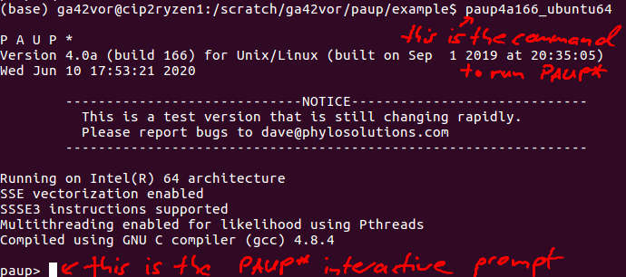

## This is a quick intro in batch-processing phylogenetic data files with PAUP* and Python

### Overview
The goal is to call PAUP* from a Python script to evaluate phylogenetic data both using both neighbor-joining and maximum parsimony.

In order to run, PAUP* relies on NEXUS-files. With a complete NEXUS-file you can run PAUP* with a single command using the non-interactive mode.

### Run PAUP* in the non-interactive mode in the command line

Step 1: Make sure that you can run PAUP* , i.e. your PAUP* installation is working. For me, typing ’paup4a166_ubuntu64’ in the terminal brings me to the interactive PAUP* mode.

You can quit PAUP* by typing ’q’
